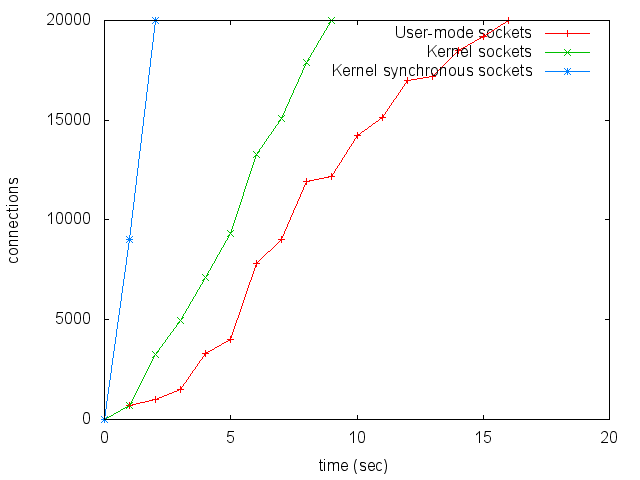
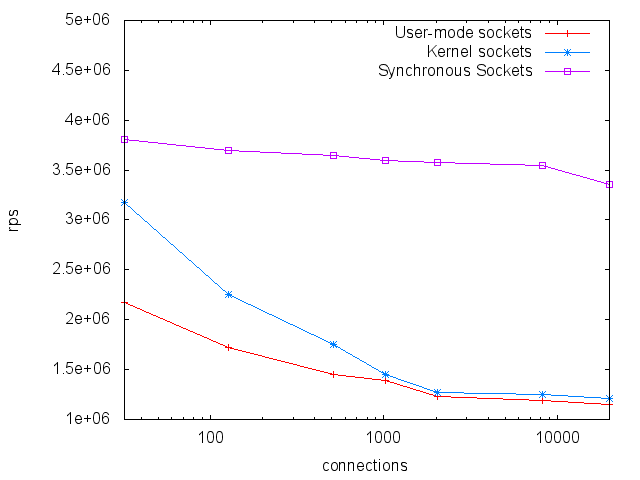

## Linux Kernel Synchronous Sockets

### What it is?

This is Linux kernel module which exports set of socket functions to other
kernel modules, i.e. it can be called kernel library.
The library was initially developed as a part of HTTP reverse proxy, so that it
can handle hundreds of thousands short-living connections.
Thus it supports only server-side TCP sockets for now.

The sockets are working in softirq context, so context switches and memory
footprint are reduced.

The API is inconsistent by nature since it uses upcalls and downcalls at once
(in difference with Berkeley Socket API which uses downcalls only).
It uses upcalls to react on socket events (new data arrived, connection error
etc) and downcalls to perform user operations (e.g. connect to a host).

The module uses number of standard Linux calls (currently TCP only), so the
kernel must be patched with linux-3.10.10-sync\_sockets.diff firstly.

See [What's Wrong With Sockets Performance And How to Fix It]
(http://natsys-lab.blogspot.ru/2013/03/whats-wrong-with-sockets-performance.html)
for design concepts.

### Performance

For experiments experiments we used two servers.
The first server, 10-core (1 processor with 10 cores)
Intel Xeon E7 - 4850 64GB RAM, was used to run server side tests.
The second, 6 cores Intel Xeon X5675 32GB RAM, was used to run traffic generator.
Both the servers were linked using 10Gbps Intel adapters with separate RX and TX queues.
The traffic generator was running Linux 2.6.32 and the server - Linux 3.10.10.

We made performance measurements for Synchronous Sockets API and
compared them with plain kernel sockets (written similar to the code used in
Ceph) and user-mode socket implementation with optimizations of connection accepting.
In all the cases there was multi-threading TCP client which establishes many
connections with the server in all the threads and sends few thousands 64-byte
messages on each connection.
The servers simply read messages and accept new connections in one thread.

Firstly, we've tested how quickly 20 thousands connections can be established
in parallel with sending message on already open connections (i.e. when a
connection is established it immediately starts to transfer messages).

The second test with socket implementation which we done is how requests per
second characteristic depends on number of established connections.

### Usage Examples

You can find example of the API usage in t/kernel/sync\_kserver.c .

### Build

	$ cd sync_socket && make        # build the kernel module
	$ cd t && make                  # build tests

### TODO for further development

* More accurate (and fast) ss\_drain\_accept\_queue() implementation
  (kernel patching is needed);
* Synchronous client side socket API (e.g. connect());
* UDP and SCTP support.
